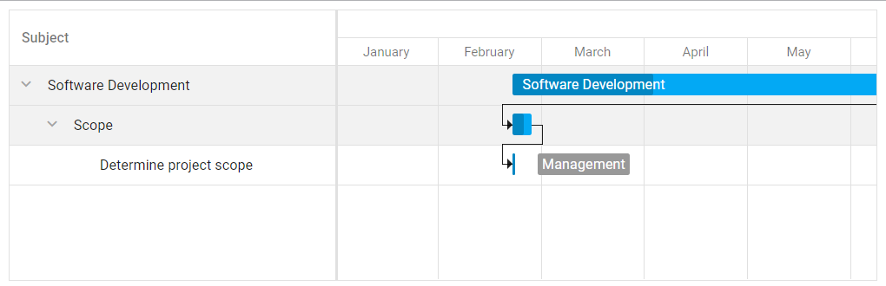

<!-- default badges list -->

<!-- default badges end -->
# DevExtreme Gantt - Getting Started 

This repository stores code examples for the following documentation article: [Getting Started with DevExtreme Gantt Component](https://js.devexpress.com/Documentation/Guide/UI_Components/Gantt/Getting_Started_with_Gantt/). The tutorial shows how you can add a Gantt to a page, bind it to data, and configure its core features. Upon completion, the component displays a task flow with dependencies between tasks. 

## Files to Review

- **Angular**
    - [app.component.html](Angular/src/app/app.component.html)
    - [app.component.ts](Angular/src/app/app.component.ts)
- **jQuery**
    - [index.js](jQuery/src/index.js)
- **React**
    - [App.js](React/src/App.js)
- **Vue**
    - [App.vue](Vue/src/App.vue)

## Documentation

- [Getting Started with Gantt](https://js.devexpress.com/Documentation/Guide/UI_Components/Gantt/Getting_Started_with_Gantt/)

- [Gantt - API Reference](https://js.devexpress.com/Documentation/ApiReference/UI_Components/dxGantt/)
<!-- feedback -->
## Does this example address your development requirements/objectives?

 

(you will be redirected to DevExpress.com to submit your response)
<!-- feedback end -->
